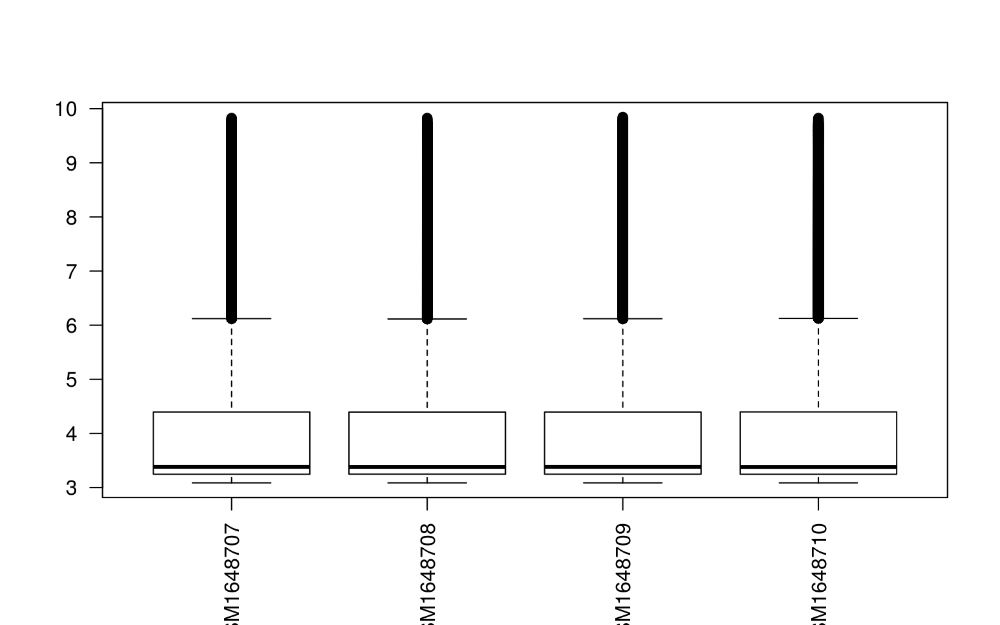
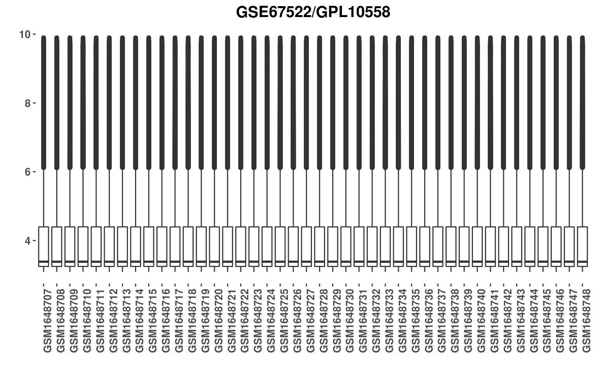
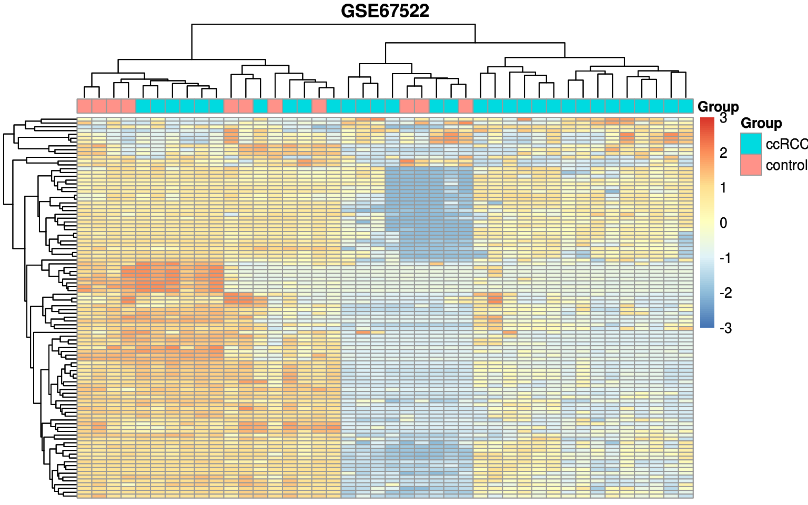
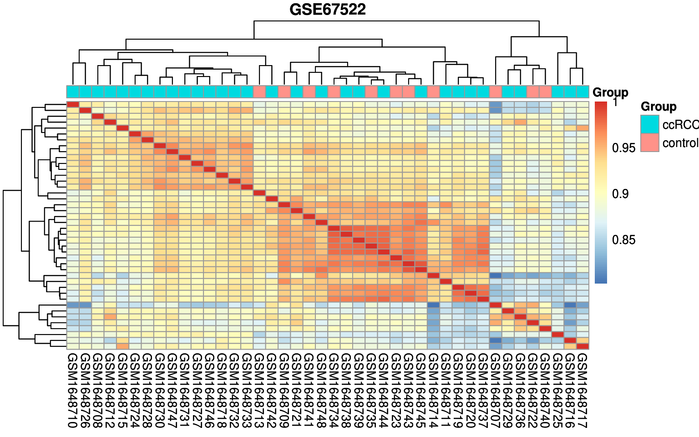
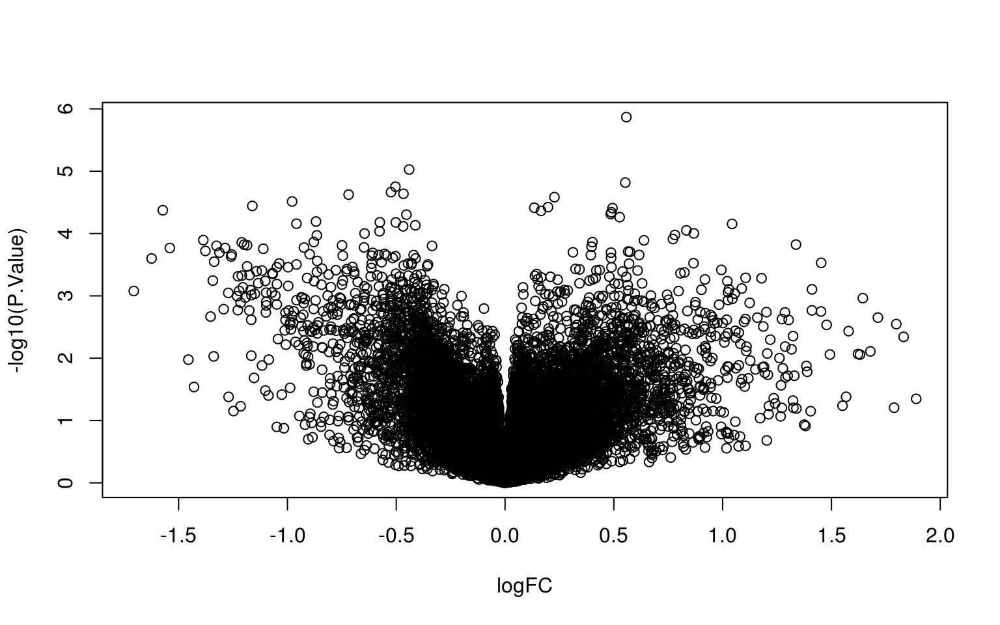
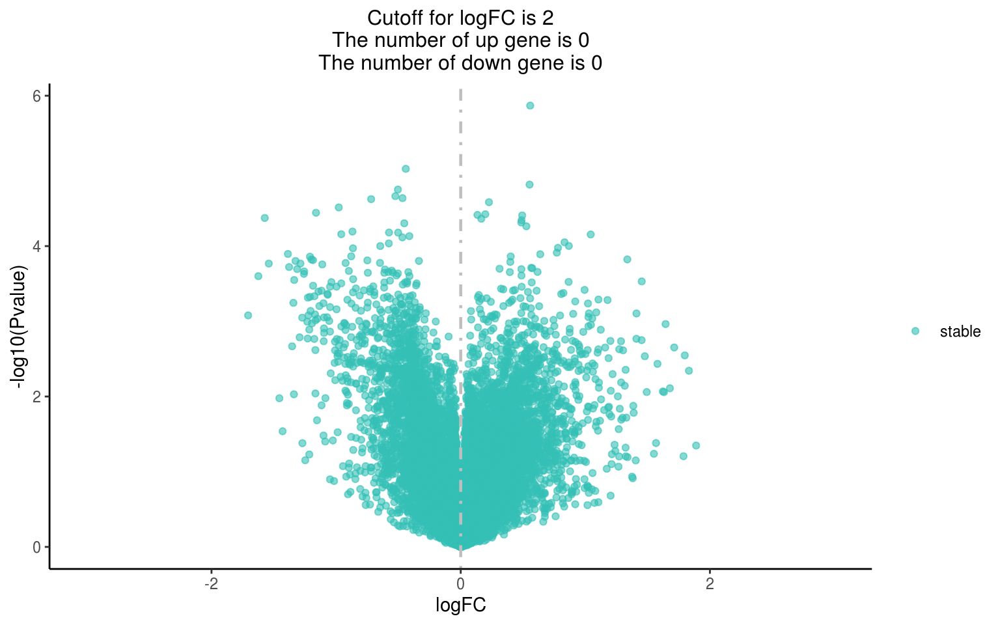
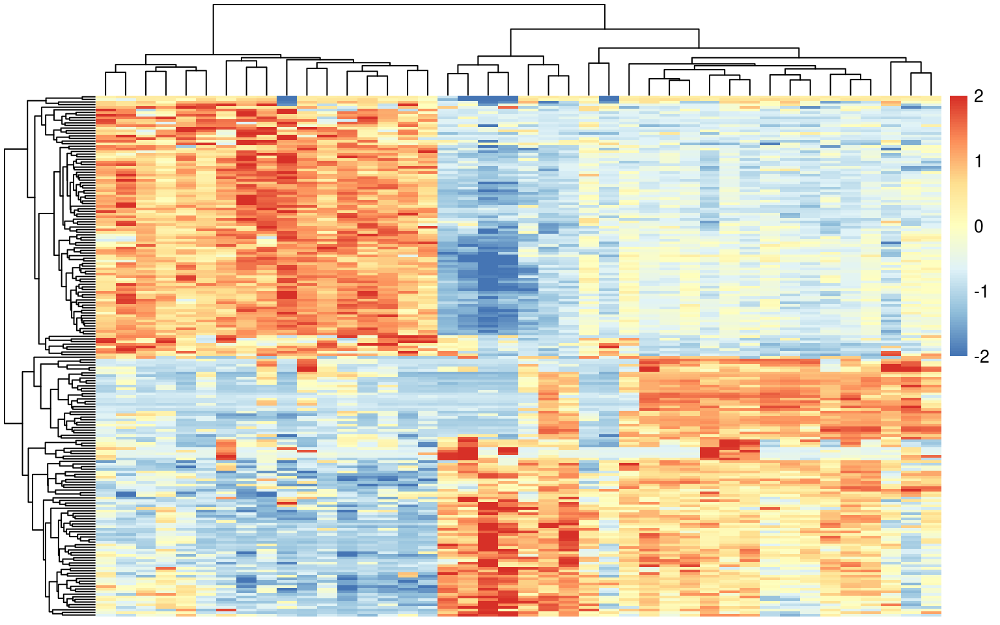
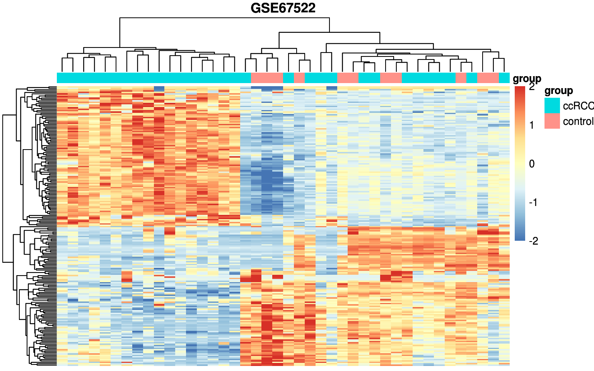
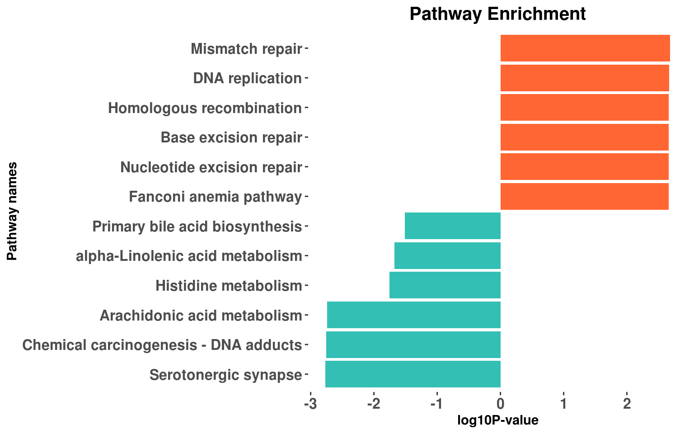
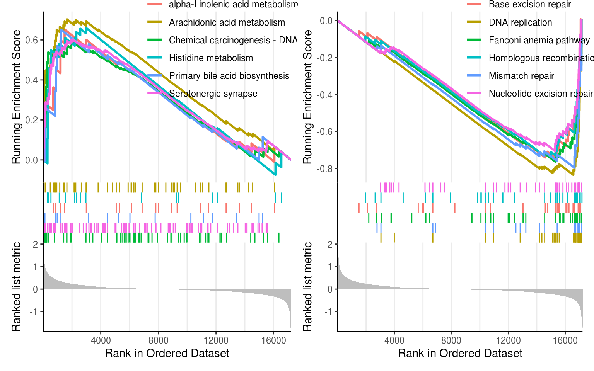

### 一、数据集介绍

- GEO链接： https://www.ncbi.nlm.nih.gov/geo/query/acc.cgi?acc=GSE67522

- 芯片平台： [GPL4866](https://www.ncbi.nlm.nih.gov/geo/query/acc.cgi?acc=GPL4866),  Affymetrix GeneChip Human Genome U133 Plus 2.0 Array [MBNI v6 Entrez Gene ID CDF]
	


样品列表：

```
             title        source_name_ch1
GSM1648707	HPV Negative Control_1
GSM1648708	High HOTAIR CaCx_1
GSM1648709	HPV Negative Control_2
GSM1648710	Low HOTAIR CaCx_1
GSM1648711	Non-malignant_1
GSM1648712	Low HOTAIR CaCx_2
GSM1648713	HPV Negative Control_3
GSM1648714	HPV Negative Control_4
GSM1648715	High HOTAIR CaCx_2
GSM1648716	Low HOTAIR CaCx_3
GSM1648717	Low HOTAIR CaCx_4
GSM1648718	Low HOTAIR CaCx_5
GSM1648719	Non-malignant_2
GSM1648720	Non-malignant_3
GSM1648721	Non-malignant_4
GSM1648722	HPV Negative Control_5
GSM1648723	HPV Negative Control_6
GSM1648724	Low HOTAIR CaCx_6
GSM1648725	Low HOTAIR CaCx_7
GSM1648726	Low HOTAIR CaCx_8
GSM1648727	Low HOTAIR CaCx_9
GSM1648728	Low HOTAIR CaCx_10
GSM1648729	Low HOTAIR CaCx_11
GSM1648730	Low HOTAIR CaCx_12
GSM1648731	Low HOTAIR CaCx_13
GSM1648732	Low HOTAIR CaCx_14
GSM1648733	Low HOTAIR CaCx_15
GSM1648734	HPV Negative Control_7
GSM1648735	HPV Negative Control_8
GSM1648736	Non-malignant_5
GSM1648737	Non-malignant_6
GSM1648738	Non-malignant_7
GSM1648739	Non-malignant_8
GSM1648740	HPV Negative Control_9
GSM1648741	HPV Negative Control_10
GSM1648742	Non-malignant_9
GSM1648743	HPV Negative Control_11
GSM1648744	Non-malignant_10
GSM1648745	Non-malignant_11
GSM1648746	Low HOTAIR CaCx_16
GSM1648747	Low HOTAIR CaCx_17
GSM1648748	Low HOTAIR CaCx_18
```

- 文章链接是：	
Sharma S, Mandal P, Sadhukhan T, Roy Chowdhury R et al. Bridging Links between Long Noncoding RNA HOTAIR and HPV Oncoprotein E7 in Cervical Cancer Pathogenesis. PMID: 26152361 (https://www.ncbi.nlm.nih.gov/pubmed/26152361)

- Saha SS, Chowdhury RR, Mondal NR, Roy S et al. Expression signatures of HOX cluster genes in cervical cancer pathogenesis: Impact of human papillomavirus type 16 oncoprotein E7. PMID: 28402266 (https://www.ncbi.nlm.nih.gov/pubmed/28402266)

### 二、核心步骤

#### 1. R包加载
```R
rm(list = ls())
library(AnnoProbe)
library(GEOquery)  
library(ggplot2) 
library(ggstatsplot) 
library(reshape2)
library(patchwork)
```

#### 2. 获取并且检查表达量矩阵

* 主要是得是否需要log
```R
# 获取表达量矩阵
gse_number <- 'GSE67522'
gset <- geoChina(gse_number)
a=gset[[1]] 
dat=exprs(a) 
dim(dat)

# 检查，判断需不需要取log
dat[1:4,1:4] 
boxplot(dat[,1:4],las=2)
```

```
##               GSM1648707  GSM1648708  GSM1648709  GSM1648710
## ILMN_1343291 17647.26933 12381.72978 17232.93645 14511.71240
## ILMN_1343295  5476.44376  7426.27919  5368.03455 13894.05359
## ILMN_1651199    24.74108    24.74703    22.81707    23.46795
## ILMN_1651209    29.36001    30.52691    33.91641    27.50097
```
```R
library(limma)
dat=normalizeBetweenArrays(dat)

# 画图，使用ggplot需宽数据变长数据
class(dat)
data <- as.data.frame(dat)
data <- melt(data)
head(data)

title <- paste (gse_number, "/", a@annotation, sep ="")
p1 <- ggplot(data,aes(x=variable,y=value))+
      geom_boxplot()+
      theme_ggstatsplot()+
      theme(panel.grid = element_blank(),
            axis.text=element_text(size=10,face = 'bold'),
            axis.text.x=element_text(angle=90),
            plot.title = element_text(hjust = 0.5,size =15))+
      xlab('')+
      ylab('')+
      ggtitle(title)
p1
```

可以看到，处理前后我们的表达量矩阵的表达量范围箱线图如下所示：

#### 3. 根据生物学背景及研究目的人为分组
```R
pd=pData(a) 
#通过查看说明书知道取对象a里的临床信息用pData
## 挑选一些感兴趣的临床表型。
head(pd)[,1:4]
library(stringr)  
# normal or others, look the table carefully.
group_list=ifelse(grepl('Normal',pd$title),'control','ccRCC')
table(group_list)
## group_list
##   ccRCC control 
##      31      11
```

为了演示方便，我们这里仅仅是区分"ccRCC"和“control”。

#### 4. probe_id 和symbol的转换至表达矩阵

* 获取芯片注释信息
```R
gpl_number='GPL4866'
  gpl = getGEO(gpl_number,destdir = ".")
  id_pre = gpl@dataTable@table
  colnames(id_pre)
# # Symbol or Gene Symbol
  ids2 = id_pre[,c("ID","Symbol")]
  colnames(ids2) = c("probe_id","symbol")
  ids2 = ids2[ids2$symbol!=" " & ids2$symbol!="NA" & !str_detect(ids2$symbol,"///") & rownames(ids2)!="NA",]
head(ids2)
##       probe_id                  symbol
## 1 ILMN_1343048     phage_lambda_genome
## 2 ILMN_1343049     phage_lambda_genome
## 3 ILMN_1343050 phage_lambda_genome:low
## 4 ILMN_1343052 phage_lambda_genome:low
## 5 ILMN_1343059                    thrB
## 6 ILMN_1343061 phage_lambda_genome:mm2
#可以看到此芯片的探针与基因ID或者symbol的对应关系
```

* 整理芯片注释信息，使探针与基因symbol无重复且一一对应
```R
library(tidyr)
library(dplyr)
library(stringr)
ids=ids2

#接下来，使探针与基因symbol一一对应
ids=as.data.frame(ids)
table(rownames(dat) %in% ids$probe_id)
dat=dat[rownames(dat) %in% ids$probe_id,]
ids=ids[match(rownames(dat),ids$probe_id),]
ids$probe_id=as.character(ids$probe_id)
rownames(dat)=ids$probe_id
ids=ids[ids$probe_id %in%  rownames(dat),]
dat=dat[ids$probe_id,]

#下一步是：基因symbol去冗余-按照表达量最大值筛选
ids$median=apply(dat,1,median)
#ids新建median这一列，列名为median，同时对dat这个矩阵按行操作，取每一行的中位数，将结果给到median这一列的每一行
ids=ids[order(ids$symbol,ids$median,decreasing = T),] 
#对ids$symbol按照ids$median中位数从大到小排列的顺序排序，将对应的行赋值为一个新的ids
ids=ids[!duplicated(ids$symbol),]#将symbol这一列取取出重复项，'!'为否，即取出不重复的项，去除重复的gene ，保留每个基因最大表达量结果s
#获得去冗余之后的dat/exp
dat=dat[ids$probe_id,] #新的ids取出probe_id这一列，将dat按照取出的这一列中的每一行组成一个新的dat
#把ids的symbol这一列中的每一行给dat作为dat的行名
rownames(dat)=ids$symbol
table(group_list)
```

最后得到了表达量矩阵如下所示：

```r
> dat[1:4,1:4]  #保留每个基因ID第一次出现的信息
GSM1648707 GSM1648708 GSM1648709 GSM1648710
ZZZ3     5.297163   5.137584   5.661561   5.256388
ZZEF1    5.260749   5.004805   5.277681   5.510634
ZYX      7.816575   6.888377   5.836890   5.619233
ZYG11B   7.512788   7.025473   6.906990   6.363292

```

以及最简单的2分组，如下所示：

```R
>table(group_list)
##   ccRCC control 
##      31      11
```

保存为R数据文件：step1-output.Rdata
```R
save(dat,ids,group_list,gse_number,file = "step1-output.Rdata")
```

### 三、标准步骤之质控

得到标准的**3张图**，包括主成分分析，高变基因的表达量热图，样品相关性热图

```R
## 下面是画PCA的必须操作，需要看说明书。
exp <- dat
exp=t(exp)#画PCA图时要求是行名时样本名，列名时探针名，因此此时需要转换
exp=as.data.frame(exp)#将matrix转换为data.frame 
library("FactoMineR")#画主成分分析图需要加载这两个包
library("factoextra")  
dat.pca <- PCA(exp , graph = FALSE)#现在exp最后一列是group_list，需要重新赋值给一个dat.pca,这个矩阵是不含有分组信息的
dim(exp)
exp[,12488]
# 画图，主成分分析图p2
this_title <- paste0(gse_number,'_PCA')
p2 <- fviz_pca_ind(dat.pca,
                         geom.ind = "point", # show points only (nbut not "text")
                         col.ind = group_list, # color by groups
                         palette = "Dark2",
                         addEllipses = TRUE, # Concentration ellipses
                         legend.title = "Groups")+
                   ggtitle(this_title)+
                   theme_ggstatsplot()+
                   theme(plot.title = element_text(size=15,hjust = 0.5))

p2
```

```R
# 下面是1000_sd热图
library(pheatmap)
cg=names(tail(sort(apply(dat,1,sd)),100))#apply按行（'1'是按行取，'2'是按列取）取每一行的方差，从小到大排序，取最大的100个
n=t(scale(t(dat[cg,]))) 
n[n>2]=2 
n[n< -2]= -2
n[1:4,1:4]
ac=data.frame(Group=group_list)
rownames(ac)=colnames(n)
# 画图，高变基因的表达量热图p3
p3 <- pheatmap::pheatmap(n,
               show_colnames =F,
               show_rownames = F,
               main = gse_number,
               annotation_col=ac,
               breaks = seq(-3,3,length.out = 100))#因为已经手动设置了表达量最大值，所以，可以不用设置break
p3
```

```R
# 画图，样品相关性热图p4
colD=data.frame(Group=group_list)
exprSet=t(exp)
rownames(colD)=colnames(exprSet)#问题-exprSet设置成转置后的exp
p4 <- pheatmap::pheatmap(cor(exprSet),#热图对样本-列 操作
                   annotation_col = colD,
                   show_rownames = F,
                   main = gse_number
                   )
p4
```

### 四、标准步骤之limma差异分析


```R
library(limma)
design=model.matrix(~factor( group_list ))
fit=lmFit(dat,design)
fit=eBayes(fit)
options(digits = 4) #设置全局的数字有效位数为4
deg = topTable(fit,coef=2,adjust='BH', n=Inf) 
```

有了差异分析就可以进行标准的可视化，包括**火山图和上下调的差异基因热图**

```R
nrDEG=deg
head(nrDEG)
attach(nrDEG)
plot(logFC,-log10(P.Value))#简单画图看一下
```


```R
df=nrDEG
df$v= -log10(P.Value) #df新增加一列'v',作为新的绘图参数，值为-log10(P.Value) 
#设定上下调基因
df$g=ifelse(df$P.Value>0.05,'stable', 
              ifelse( df$logFC >2,'up', 
                      ifelse( df$logFC < -2,'down','stable') )
)
#统计上下调基因数量
table(df$g)
#给绘制火山图用的数据新增一列symbol
df$name=rownames(df)
head(df)
logFC_t = 2
#设置可循环使用的plot标题
this_tile <- paste0('Cutoff for logFC is ',round(logFC_t,3),
                      '\nThe number of up gene is ',nrow(df[df$g == 'up',]) ,
                      '\nThe number of down gene is ',nrow(df[df$g == 'down',])
)
#画图，火山图p5
p5 <- ggplot(data = df, 
              aes(x = logFC, 
                  y = -log10(P.Value))) +
    geom_point(alpha=0.6, size=1.5, 
               aes(color=g)) +
    ylab("-log10(Pvalue)")+
    scale_color_manual(values=c("#34bfb5", "#828586","#ff6633"))+
    geom_vline(xintercept= 0,lty=4,col="grey",lwd=0.8) +
    xlim(-3, 3)+
    theme_classic()+
    ggtitle(this_tile )+
    theme(plot.title = element_text(size=12,hjust = 0.5),
          legend.title = element_blank(),
          )
p5

```

```R
#热图
library(pheatmap)
x=deg$logFC 
names(x)=rownames(deg) 
cg=c(names(head(sort(x),100)),
       names(tail(sort(x),100)))#对x进行从小到大排列，取前100及后100，并取其对应的探针名，作为向量赋值给cg
n=t(scale(t(dat[cg,])))
n[n>2]=2
n[n< -2]= -2
n[1:4,1:4]
pheatmap(n,show_colnames =F,show_rownames = F)
```

```R
ac=data.frame(group=group_list)
rownames(ac)=colnames(n) 
# 画图，上下调的差异基因热图p6
p6 <- pheatmap(n,show_colnames =F,
           show_rownames = F,
           cluster_cols = T, 
           main = gse_number,
           annotation_col=ac) 
p6
```

### 五、标准步骤之生物学功能数据库注释

我们这里不根据**任何武断的阈值来区分统计学显著的上下调基因**，而是直接根据基因的变化情况排序进行gsea分析，而且仅仅是展示kegg这个生物学功能数据库的注释情况！

* gsea分析需要基因的ENTREZID，需要根据物种进行转换
```R
# 加ENTREZID列，用于富集分析（symbol转entrezid，然后inner_join）
deg$symbol=rownames(deg)
library(org.Hs.eg.db)
library(clusterProfiler)
s2e <- bitr(deg$symbol, 
            fromType = "SYMBOL",
            toType = "ENTREZID",
            OrgDb = org.Hs.eg.db)#人
#bitr()用于SYMBOL转ENTREZID
#其他物种http://bioconductor.org/packages/release/BiocViews.html#___OrgDb
dim(deg)
dim(s2e)
setdiff(deg$symbol,s2e$SYMBOL)
DEG <- inner_join(deg,s2e,by=c("symbol"="SYMBOL"))

```

* 进行gsea富集
```R
library(dplyr)
library(ggplot2)  
geneList=DEG$logFC
names(geneList)=DEG$ENTREZID
geneList=sort(geneList,decreasing = T)
head(geneList)
library(clusterProfiler)
kk_gse <- gseKEGG(geneList     = geneList,
                  organism     = 'hsa',#按需替换
                  #nPerm        = 1000,
                  minGSSize    = 10,
                  pvalueCutoff = 0.9,
                  verbose      = FALSE)
tmp=kk_gse@result
dim(tmp)
kk=DOSE::setReadable(kk_gse, OrgDb='org.Hs.eg.db',keyType='ENTREZID')#按需替换
#DOSE::setReadable():mapping geneID to gene Symbol
tmp=kk@result
dim(tmp)
pro='comp1'
write.csv(kk@result,paste0(pro,'_kegg.gsea.csv'))
save(kk,file = 'gsea_kk.Rdata')
```

上面的kk这个变量就存储了kegg这个生物学功能数据库的gsea分析结果，我们进行简单可视化，代码如下：

```R
# 展现前6个上调通路和6个下调通路
down_k <- kk_gse[tail(order(kk_gse$enrichmentScore,decreasing = F)),];down_k$group=-1
up_k <- kk_gse[head(order(kk_gse$enrichmentScore,decreasing = F)),];up_k$group=1

dat=rbind(up_k,down_k)
colnames(dat)
dat$pvalue = -log10(dat$pvalue)
dat$pvalue=dat$pvalue*dat$group 
dat=dat[order(dat$pvalue,decreasing = F),]
# gsea分析结果p7
p7<- ggplot(dat, aes(x=reorder(Description,order(pvalue, decreasing = F)), y=pvalue, fill=group)) + 
  geom_bar(stat="identity") + 
  scale_fill_gradient(low="#34bfb5",high="#ff6633",guide = FALSE) + 
  scale_x_discrete(name ="Pathway names") +
  scale_y_continuous(name ="log10P-value") +
  coord_flip() + 
  theme_ggstatsplot()+
  theme(plot.title = element_text(size = 15,hjust = 0.5),  
        axis.text = element_text(size = 12,face = 'bold'),
        panel.grid = element_blank())+
  ggtitle("Pathway Enrichment") 
p7

```

```R
#具体看上面条形图里面的每个通路的gsea分布情况p8
library(enrichplot)
p8 <- gseaplot2(kk, geneSetID = rownames(down_k))+
      gseaplot2(kk, geneSetID = rownames(up_k))
p8
```
